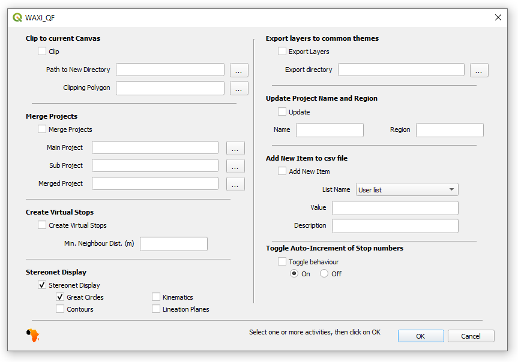

# WAXI_QF
 QGIS Plugin to help QFIELD usage related to the WAXI QFIELD Template V 0.2 (ctrl click on the link to access latest template): https://zenodo.org/record/7882352 
 
## Install
Save repository to disk as a zip file. Use QGIS Plugin Manager to load directly from zip file.

## Usage
1. Select the plugin using the WAXI logo    

  

2. To clip all layers to surrent Canvas, select the Clip check box and define a new directory to contain all the layers
3. And/or select the Add New item to CSV file check box and select whoch file to add item to and define Value and it's Description
4. And/or select select the Merge Projects check box and two existing project directories and a new one to store newly merged projects, with duplicates removed. An existing project must be open at the moment.
5. And/or select select the Export layers to common themes check box and directory so zones, structures and lithologies can be merged as 3 composite shapefiles
6. Click on OK, new Clipped Project will be created and/or new user will be added to *User list.csv* and/or new merged project will be created

## Roadmap
1) Add users, rock types, etc to csv lists   

c.f. addUserName code OR via upload of csvs or delimted data

2) Spatial subset extraction to new project   

Done but what to do about GEOGRAPHY & ORTHOPHOTO directories, and qgz project file?   

3) Merge projects   

Done but not sure how to handle GEOGRAPHY & ORTHOPHOTO directories, and qgz project file  

4) Export geometries to produce single shapefiles (structures, litho, stops, zones, petrophysics)   

Done, not sure what to do with other unique layers, copy them over?     
   
## Credits    
Plugin construction - Mark Jessell using QGIS Plugin Builder Plugin    
QFIELD Template - Julien Perret    
