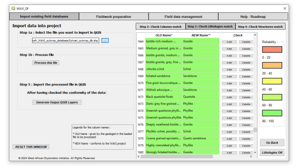
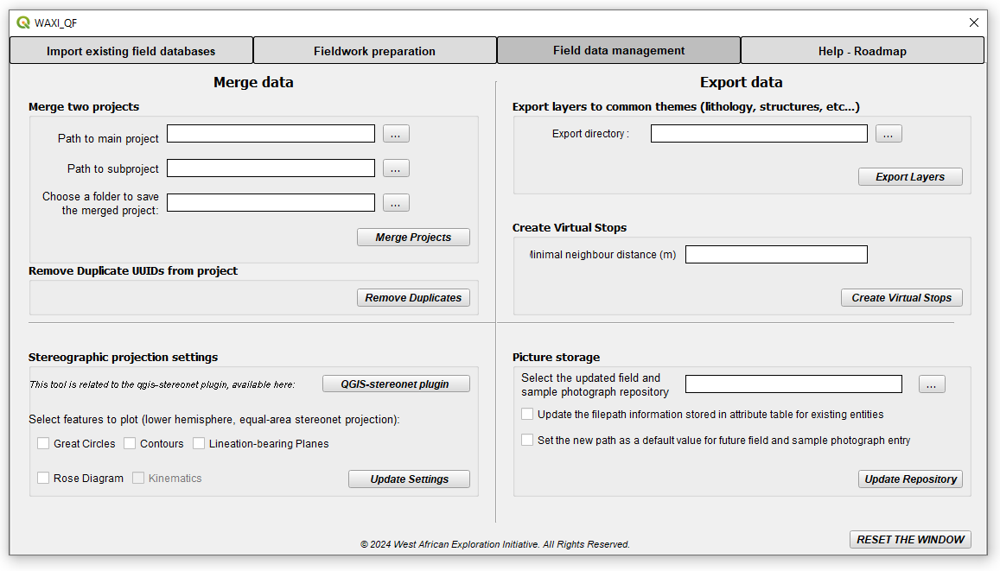

# WAXI_QF
 QGIS Plugin to help QFIELD usage related to the latest WAXI QFIELD Template (ctrl click on the link to access latest template): https://doi.org/10.5281/zenodo.7834717
 
## Install
Save repository to disk as a zip file. Use QGIS Plugin Manager to load directly from zip file.

## Usage
**Select the plugin using the WAXI logo**      

**An existing WAXI QFIELD project must be open when you run this plugin, otherwise the Dialog will not display.**

## Functionality
- **Import Layers** Convert pre-existing data into a WAXI QF Template ready for merging, uses fuzzy logic to suggest best choices for lithology labels.   

- **Clip to current Canvas**: Select checkbox to clip all WAXI QFIELD layers to surrent QGIS Canvas, select the Clip check box and define a new directory to contain all the layers. Optionally select a polygon shapefile to be the clipping polygon. You can use the **Merge Projects** tool to recombine any modififications you have made to this clipped region  back into the global dataset.   
- **Update the Project name**: Select checkbox to update the project name and field region for a new field campaign.   
- **Toggle Auto-Increment of Stop numbers**: Select checkbox and toggle Stop Number autoincrementing behaviour when a new stop is defined.    
- **Add New item to CSV file**: Select checkbox and select which file to add item to and define Value and it's Description, and this will update the relevant csv file, so it becomes available in the WAXI QFIELD dropdown menus.    
- **Set User by Default**: Assign an existing or new user to be the default for one layer or all layers going forward.   
- **Update the repository path for pictures**: Allows a new directory to be defined for the storage of either/or field pictures and sampling points.   

- **Merge Projects**: Select checkbox to merge two existing WAXI QFIELD projects by selecting two existing project directories and a new one to store newly merged projects. Duplicate rows in each layer will be deleted. 3.    
- **Create Virtual Stops**: Select checkbox and define clustering distance to add a cluster code to all diferent types of points observations according to locality, using a DBSCAN algorithm. This will create a new layer called *Virtual_Stops_datestamp*.  This can be very slow for large datasets, so probably best applied to clipped data for a region of interest.   
- **Export layers to common themes**: Select checkbox and define directory to export all point, polygon and polyline which are combined to three  shapefiles for zones, structures and lithologies.    
- **Stereonet Control**: Select Stereonet checkbox to control WAXI fork of Stereonet plugin display (https://github.com/swaxi/qgis-stereonet) .  
- **Save new *.qlr file**: Allows a custom style file to be created for template. Users suppplies direcotry path.   
     

## Roadmap

Add centroids of polygon and line features when creating virtual stop layer.
   
## Credits    
Plugin construction - Eliott Betend GUI and Import Tool    
Plugin construction - Mark Jessell using QGIS Plugin Builder Plugin    
QFIELD Template - Julien Perret    