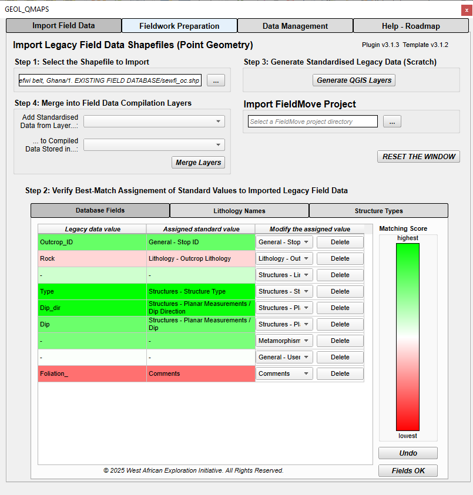
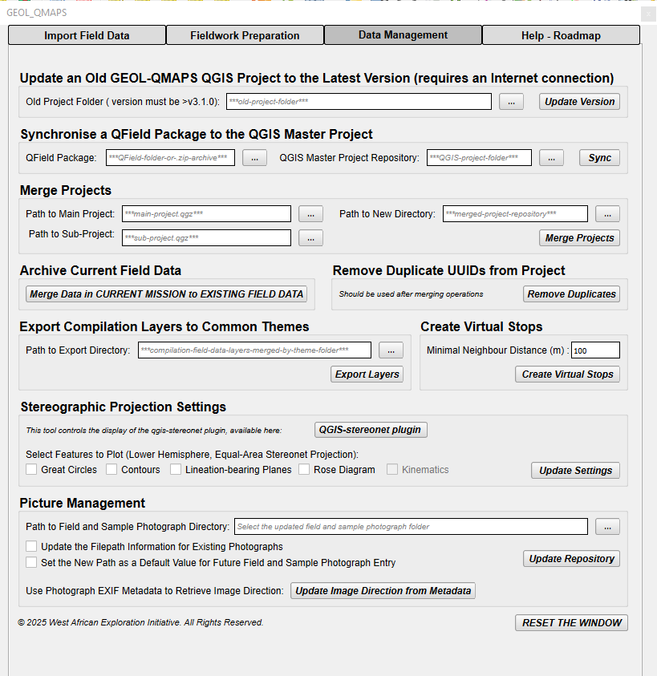
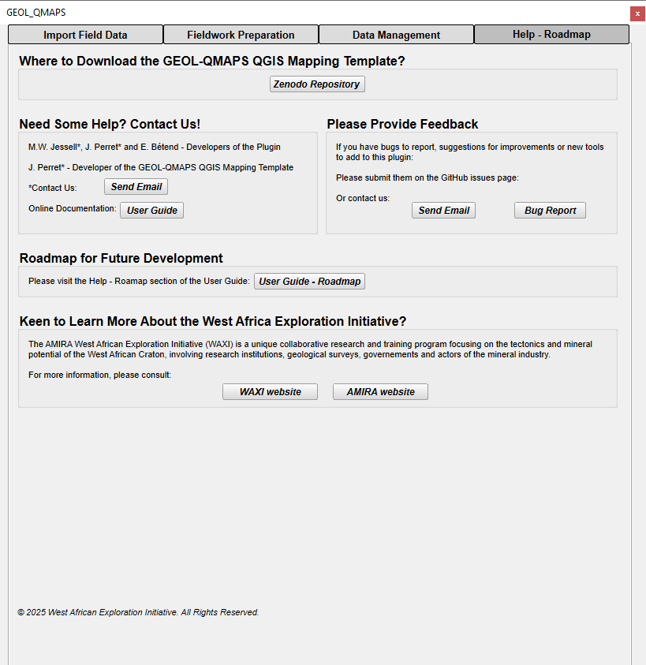

# GEOL-QMAPS Digital Geological Mapping Solution 

*version 3.1.3 - April 2025*

## 1. Description

GEOL-QMAPS, an open-source, QGIS-based solution promoting digital geological mapping in a harmonised, comprehensive and flexible way. 
It can be used in the field with a tablet PC or via the QGIS-based QField app on iOS or Android mobile devices, enabling synchronisation with desktop QGIS and the creation of field databases.

Designed as a general solution, the GEOL-QMAPS solution consists of a QGIS field data entry template and a custom QGIS plugin, both available on free-access online repositories.

* **GEOL-QMAPS QGIS Template**: latest release available on [Zenodo](https://doi.org/10.5281/zenodo.7834717)

* **GEOL-QMAPS QGIS Plugin**: available on [GitHub](https://github.com/swaxi/WAXI_QF)
 
The plugin allows for a range of actions, from import and harmonisation of existing field databases to GEOL-QMAPS standards, customisation of the QGIS project template to different mapping guidelines, and field database management and first processing. 

## 2. Citation

An open-acces paper describing the GEOL-QMAPS solution has been published:

> *Perret, J., Jessell, M.W., Bétend, E., 2024. An open-source, QGIS-based solution for digital geological mapping: GEOL-QMAPS. Applied Computing and Geosciences 100197. [https://doi.org/10.1016/j.acags.2024.100197](https://doi.org/10.1016/j.acags.2024.100197)*
  
If you use the GEOL-QMAPS mapping solution, we would greatly appreciate it if you cite this publication.

## 3. Software Specifications

The current version of GEOL-QMAPS is supported by *QGIS 3.42.0 (Münster)* and *QField 3.5.4 (Fangorn)*.

> [!IMPORTANT] 
> *Ensure that the GEOL-QMAPS tools are compatible with the version of QGIS installed on your computer, as using an incompatible version may lead to malfunctions, especially for the plugin tools. 
> Visit [QGIS website](https://download.qgis.org/downloads/) to download the appropriate version of QGIS Desktop.* 

## 4. Installation

### *4.1. GEOL-QMAPS QGIS Template* 
* Visit [the Zenodo repository of the QGIS template](https://zenodo.org/records/13374088)

* Save the latest version of the QGIS mapping project template to disk as a zip file

* Unzip the `GEOL_QMAPS_vX.X.X.zip` repository (version X.X.X). It contains:
  * a **`.\QGIS_TEMPLATE`** folder with the QGIS mapping project file, relevant field data entry files and database repositories, 
  * a log file (**`List of updates of the different releases.docx`**),

### *4.2. GEOL-QMAPS QGIS Plugin* 
*Option 1*
* The current plugin version and further releases will be made avalaible in the QGIS Plugin Manager Repository.

* Open the QGIS Plugin Manager, navigate to the **`Settings`** tab and enable the **Show also Experimental Plugins** option

* Switch to the **`All`** tab and search for *geol_qmaps* in the search bar
  
* Select the plugin and click on **Install Experimental Plugin**
 

*Option 2*
* Visit [the GitHub repository of the custom QGIS plugin related to the QGIS plugin](https://github.com/swaxi/WAXI_QF)

* Save **`geol-qmaps-main.zip`** repository to disk as a zip file 

* Use QGIS Plugin Manager to load directly from zip file
   
 

## 5. Workflow
The figure below, adapted from Perret et al. ([2024](https://doi.org/10.1016/j.acags.2024.100197)) illustrates the procedure for using GEOL-QMAPS from the office to the field, using both QGIS and QField tools.

> [!TIP]
> *We do not consider QFieldCloud, released by the developers of the QField app, which provides an alternative online method for synchronising and merging data collected in QField within online storage because annual fees apply for full access to cloud functionalities. 
> Yet, please not that another option is to run a local copy of QFieldCloud (available at [https://github.com/opengisch/qfieldcloud](https://github.com/opengisch/qfieldcloud)) on a private server or virtual machine.*

### *5.1. Architecture of the QGIS Mapping Template* 
#### 5.1.1. Repository Content
Open the unzipped `GEOL_QMAPS_vX.X.X`, downloaded on [Zenodo](https://zenodo.org/records/13374088) (version X.X.X).

The `.\QGIS_TEMPLATE` repository contains several sub-folders where relevant geodata can be sorted by theme. 

All folders are empty, except for:
* the `.\.\0_FIELD_DATA` sub-folder, which contains:
  * a **`CURRENT_MISSION.gpkg`** geopackage with all empty field data entry layers,
  * a **`.\.\.\DCIM`** subfolder to store field and sample photographs,
  * a **`CURRENT_MISSION+DICTIONARIES.qlr`** layer style definition file.

* the `1_EXISTING_FIELD_DATABASE` sub-folder, which contains a **`COMPILATION.gpkg`** geopackage, with the same field data layers as the **`CURRENT_MISSION.gpkg`** geopackage. It has been designed to store legacy field data imported to the GEOL-QMAPS QGIS project and data collected using the solution during previous field campaigns,  using the custom QGIS plugin *(see sub-section 6.4.)*,

* the `.\.\11_ORTHOPHOTOGRAPHY-SATELLITE_IMAGERY` sub-folder with an extract of ©Google Satellite imagery centred on Africa (spatial resolution of 5 km), which is used as a base map in the blank QGIS template.

Folders `.\.\2_GPS-LOCALITIES_OF_INTEREST` to `.\.\11_ORTHOPHOTOGRAPHY-SATELLITE_IMAGERY` are intended for user input. Users can store relevant geodata in these folders for subsequent upload and visualisation within the QGIS project.

 > [!CAUTION]
> *The last sub-folder of the QGIS project repository,* `.\.\99_COMMAND_FILES_PLUGIN`, *contains essential files for the custom QGIS plugin, and dictionaries used for field form completion. 
> Please refrain from modifying this folder to prevent malfunctions in field data entry and the proper functioning of the plugin tools.*

#### 5.1.2. QGIS Mapping Project Group Architecture and Collectable Field Data
Double-click on `.\.\Mission_ID_Date.qgz` to open the blank QGIS mapping template.

The following QGIS window should open (updated after [Perret et al., 2024](https://doi.org/10.1016/j.acags.2024.100197)):

 

> [!TIP]
> *For clarity and consistency, the group names in the Layers panel of the QGIS project correspond to the folder names where the associated layers should be stored. 
> If necessary, additional sub-folders can be created within the* `.\QGIS_TEMPLATE` *folder to organise existing GIS datasets covering different themes than the ones proposed. As a best practice, create matching groups in the QGIS project to align with these sub-folders and facilitate layer management.*

The figure below summarises the different field data that can be collected using the GEOL-QMAPS QGIS mapping template.

 

A detailed description of the attributes and the design of attribute forms for each field data layer is .

### *5.2. Fieldwork Preparation: Setting-up the QGIS Mapping Project and Export to QField* 
#### 5.2.1. Rename the Repository and the Name of the GEOL-QMAPS QGIS Template 
The blank template is stored as `GEOL_QMAPS_vX.X.X\QGIS_TEMPLATE\Mission_ID_Date.qgz`: feel free to move and rename the `QGIS_TEMPLATE` repository, and rename the QGIS project file.

#### 5.2.2. Import Relevant Legacy Geodata to the QGIS Mapping Project 
Folders `.\.\2_GPS-LOCALITIES_OF_INTEREST` to `.\.\11_ORTHOPHOTOGRAPHY-SATELLITE_IMAGERY` at the project root are intended for user input. Users can store relevant geodata in these folders for subsequent upload and visualisation within the QGIS project. 

For clarity and consistency, the group names in the Layers panel of the QGIS project correspond to the folder names where the associated layers should be stored. 

If necessary, additional sub-folders can be created within the `.\QGIS_TEMPLATE` folder to organise existing GIS datasets covering different themes than the ones proposed. As a best practice, create matching groups in the QGIS project to align with these sub-folders and facilitate layer management. 

The user can convert pre-existing field data into the GEOL-QMAPS QGIS template, using the custom QGIS plugin *(see sub-section 6.2.)*. These data are meant to be store in layers stored in the *EXISTING FIELD GEODATABASE* group of the QGIS project.  

Data collected during previous field campaigns using the GEOL-QMAPS solution can also be merged to the same layers *(see sub-section 6.4.)*. 

> [!TIP]
> *Import relevant online resources for map background (satellite imagery, topography, land use,* etc…*) and process the imported data in preparation for digital field mapping (take care to optimise the overall QGIS project size…).*

#### 5.2.3. Customise the GEOL-QMAPS Mapping Guidelines
A wide range of mapping preferences can be configured using the custom QGIS plugin *(see sub-section 6.2.)*. These include:
* metadata management (*e.g.,* modification of the mapping project ID and location, setting a default user for field data entry),

* legacy geodata management (*e.g.,* QGIS project clipping tool),

* field data acquisition (*e.g.,* automatic incrementation of Stop IDs, selecting between Strike (right-hand rule)-Dip and Dip-Dip Direction for planar structural measurements, using photograph metadata to retrieve image directions for field photographs),

* nomenclatures for field data entry (*e.g.,* editing dictionaries). 

> [!CAUTION]
> *If a dictionary linked to a layer’s symbol categorisation is modified, ensure that the symbology of the corresponding layer is updated. To do so, visit the* Symbology *tab after double-clicking on the name of the affected layer.*  
> *If this is not done correctly before exporting to a QField package, the default symbol will be displayed for the affected entities.*

> [!TIP]
> *Once all layers of interest are loaded and styles are defined, set up **Map Themes** in QGIS desktop to enable dynamic layer viewing in both QGIS and QField. Map themes allow for displaying a specific set of layers while hiding others, all while preserving map and layer styles. Switching between themes is easy using the **Map Themes** tab.*  
> *Please note that map themes cannot be set up in QField.*

> [!TIP]
> *The* Save Changes Made to the Field Data Forms *tool in the custom QGIS plugin enables to save a new* `.qlr` *QGIS layer definition file.*  
> *This file includes customised styles for empty field data layers and updated dictionaries. It guarantees to keep consistent mapping standards for different projects, which facilitates post-field data compilation and processing.*

#### 5.2.4. Export to QField
* Install the **QFieldSync** plugin in QGIS Desktop from the QGIS Plugin Manager

* Install QField app from *Google Play* (Android) or the *App Store* (iOS) on the mobile device you intend to use for mapping

* In QGIS, once the plugin is installed and activated, click on the ***Configure Current Project*** button, and then select the ***Cable Export*** panel:
  * Select the layer(s) that should be visible and/or editable in the field, configure the parameters as needed (*e.g.,* define a map background, geofencing, *etc…*)
  * Run the export *(the plugin will process the selected layers, creating optimised versions that are better suited for use on mobile devices)*

* Click on the ***Package for Qfield*** button *(the plugin will package the project into a format ready for QField)*:
  * Possibility to copy directories: the plugin duplicates all the files and directories associated with your project (_e.g._, layers, images, symbols) into the destination folder specified for QField
    * Original directories = files from the QGIS project in their current state
    * **Root-level duplicates = copies that will be updated while using QField**
  * Select the **`Project Folder`** where you want to save the exported project
  * Run the export

> [!TIP]
> *If storage is a concern, the user might want to review the package and remove unnecessary duplicates, though this should be done cautiously to avoid breaking the project.*  
> *Copying directories does not help much with synchronisation from QField back to QGIS: quite useless duplicates created and confusing architecture of the resulting* `QField Project Folder`….

* Transfer the `QField Project Folder` to the mobile device:
  * Once the export is complete, transfer the project folder to your mobile device
  * You can do this *via* USB, cloud storage, or any other method that allows you to move files between your computer and mobile device
  * Default storage path:
    * *Android devices:* `Android\data\ch.opengis.qfield\files\Imported Projects`
    * *iOS devices:* use `iTunes` or `Finder>File Sharing section>select QField from the list of apps`, drag and drop the `QField Project Folder` into the `QField Documents` area *(can be done using Airdrop, from Mac only)*

* Open the project in QField:
  * Launch the QField app on your mobile device
  * Navigate to the project folder transferred and open it in QField
  * The project should now be ready for use in the field.

> [!TIP]
> *Before heading to the field, test the exported project on the device to ensure everything works smoothly.*  
> *Keep a back-up of your original QGIS project before running any export.*

### *5.3. Fieldwork: Data Collection* 
Go out and collect the data. 
A detailed description of the attributes and the design of attribute forms for each field data layer is provided in the following 

To activate tracking, ensure that positioning is enabled in QField.  
Next, open the side dashboard, long-press on the **GPS Tracks_PT** where you want to save your tracks, and select the *Setup Tracking* button to configure the tracking session.

> [!TIP]
> *[Make the most of QField app functionalities](https://docs.qfield.org/how-to/)*. 
> *Keep regular back-ups of the QField folder for 1+ days-long fieldwork.*

### *5.4. Post-Fieldwork: Field Database Synchronisation*
At the end of fieldwork, save the final `QField Project Folder` in a safe depository in your computer disk.  
You may delete it from your mobile device memory once collected field data are synchronised in QGIS Desktop *(see below)* and compiled using the QGIS custom plugin *(see sub-section 6.4.)*.

> [!TIP]
> *For distributed field teams, all users can synchronise the master database daily to merge their edits. This ensures a consolidated dataset before exporting an updated* `QField Project Folder` *for the next day of mapping*. 

#### 5.4.1. Synchronise the Master QGIS Project from QField - Official Procedure
> [!TIP]
> *Before synchronising, it’s a good idea to create a backup of the original QGIS project to avoid any data loss in case of errors during synchronisation.*

* Open the original GEOL-QMAPS QGIS project

* Click on the ***Synchronize from QField*** button of the **QFieldSync** plugin

* Select the location where you copied the `QField Project Folder` that contains newly acquired field data

* Run the syncing process *(QFieldSync will compare the data in the QField project folder with the data in your original QGIS project, including new, edited and deleted features)*

* The QGIS project is now loaded with layers from the `QField Project Folder` (original layers stored in the QGIS project repository are not updated per se!)

* Save the updated QGIS project

> [!CAUTION]
> *There is a major concern with this procedure: the original data layers of the QGIS project are not loaded anymore, which causes duplication of layers and may be inconvenient for data compilation and project merging.*  
> *That is the reason why we propose a preferred synchronisation procedure below.*

#### 5.4.2. Synchronise the Master QGIS Project from QField - Preferred Procedure
* Copy the **`CURRENT_MISSION.gpkg`** geopackage file and the `DCIM` folder stored at the root level of the `QField Project Folder`, which contained all newly entered field data.

* Paste and overwrite the **`CURRENT_MISSION.gpkg`** file loaded in the root QGIS project and overwrite the `DCIM` folder at the same path, in `.\.\0_FIELD_DATA` repository.

* Repeat the two previous tasks with the **`COMPILATION.gpkg`** geopackage file stored at the root level of the `QField Project Folder` if preexisting data have been deleted or edited. It has to be copied in the `.\.\1_EXISTING_FIELD_DATABASE` folder. 

* Open the original QGIS project, which is now updated with the new field data collected

Modifications made by distributed field teams can be then compiled using the custom QGIS plugin *(see sub-section 6.4.)*.

> [!CAUTION]
> *Be careful to copy the* `QField Project Folder` *from a mobile device to a local repository or external storage device connected to the computer.*  
> *A direct copy of the* **CURRENT_MISSION.gpkg** *geopackage from the* `QField Project Folder` *on the mobile device to the* `.\.\0_FIELD_DATA` *folder containing the original geopackage file will not work.*

## 6. Usage of the Custom GEOL-QMAPS Plugin

### *6.1. Open and Navigate the Plugin*
> [!CAUTION]
> *Make sure the GEOL-QMAPS plugin is installed* (see subsection 4.2.).  
> *Also, an existing GEOL-QMAPS QGIS project compatible with the plugin version installed must be open to run this plugin, otherwise the Dialog will not display. In other words, make sure to download the [latest GEOL-QMAPS QGIS template](https://zenodo.org/records/13374088) if the updated version of the plugin is installed.*

Make sure to activate the GEOL-QMAPS plugin in the QGIS Plugin Repository Manager, and click on the plugin icon  to display the plugin window, docked to the QGIS window. 

The plugin is divided in different tabs, with tools developed to perform actions relative to the **import and harmonisation of legacy field data to the current GEOL-QMAPS mapping project**, **customisation of the mapping guidelines and setting of field data entry preferences**, and **field database management and early processing**.  

### *6.2.* Import Field Data *Tab*
#### 6.2.1. Import Legacy Field Data Shapefiles (Point Geometry)
Reformat existing lithological and structural point databases according to the architecture of the GEOL-QMAPS mapping project template, using fuzzy logic.

#### *Step 1*
Uploading and processing of the legacy database.  
Processing involves applying an arbitrary threshold to a similarity score calculated by the [*fuzzywuzzy* stringmatching library](https://github.com/seatgeek/fuzzywuzzy), after constructing a thesaurus of similar terms. The latter approach is exemplified in Joshi et al. ([2021](https://gmd.copernicus.org/articles/14/6711/2021/gmd-14-6711-2021.html)).

#### *Step 2*
User-supervised validation of the proposed indexing of fields and values during Step 2.  
The user can check and correct mismatches and, if necessary, discard values or columns from the existing field database being processed (different sub-tabs for column names, rock names, and structural data).  
A colour code assists in identifying potential mismatches.

#### *Step 3*
Generation of output QGIS layers as scratch temporary layers, once data import is validated.

#### *Step 4 - Optional*
Merging any output QGIS layer into a single layer contained within a field data compilation geopackage, that may store data imported from different sources.

#### 6.2.2. Import FieldMove Project 
Convert existing FieldMove project into GEOL-QMAPS compatible files.

### *6.3.* Fieldwork Preparation *Tab*

#### 6.3.1 Update Project ID and Location
Enter the mapping project name and the targeted field region for the new field campaign. 
These entries will automatically update the QGIS project title and set default values for the *Field Mission* and *Country* metadata, which will be recorded for any new entities added to the field data layers. 

#### 6.3.2. Set User by Default
Assign an existing or new user to be the default for one layer or all field data layers going forward.

#### 6.3.3. Edit Dictionaries
Select which dictionary to add or delete item to, and type the item to add or select the one to delete.  
New items become available in the GEOL-QMAPS field data dropdown menus.

> [!TIP]
> *Use this tool to update the list of local lithologies, the stratigraphic column or the list of users in case of distributed field teams.*

> [!CAUTION]
> *Ensure that the symbology of layers using the modified dictionary does not reference outdated or newly added values. If changes are made to the dictionary, update the layer's symbology accordingly to reflect the new items or remove those deleted. To do so, visit the* Symbology *tab after double-clicking on the name of the layer: Adjust the symbols to incorporate new values or remove those no longer valid.*  
>*If this step is not completed before exporting to a QField package, the affected entities will display the default symbol instead of the intended representation.*  

#### 6.3.4. Define Default Structural Measurement for Planar Structures
Toggle the preferred measurement convention for planar structures to establish it as the default for all layers where planar structural measurements are recorded.

#### 6.3.5. Save Changes Made to the Field Data Forms
Enables to save a new `.qlr` QGIS layer definition file in a directory to be supplied.  
This file includes customised styles for empty field data layers and updated dictionaries. It guarantees to keep consistent mapping standards for different projects, which facilitates post-field data compilation and processing.

#### 6.3.6. Clip Field Data to Current Canvas
Clip GEOL-QMAPS-standardised legacy field data layers to current QGIS Canvas, or select a polygon shapefile to be the clipping polygon. 
Define a new directory to export the QGIS project containing the clipped legacy field data.

> [!TIP]
> *Use the **Merge Projects** tool to recombine any modififications you have made to this clipped region back into the global dataset.*

> [!CAUTION]
> *The tool does not clip field data contained in the* CURRENT MISSION *group in QGIS. However, this group should remain empty during the fieldwork preparation stage, so this limitation should not affect standard workflows.*  
> *Legacy geodata layers, which are loaded for visualisation purposes in the field, are stored in the* LOCALITIES OF INTEREST *to* SATELLITE IMAGERY-ORTHOPHOTOGRAPHY *groups within the GEOL-QMAPS QGIS template. Clipping these data layers must be performed using the QGIS Toolbox as this functionality is not handled directly by the plugin tool.*

### *6.4.* Data Management *Tab*

#### 6.4.1. Merge Projects
Select two existing GEOL-QMAPS projects by selecting two existing project directories and a new one to store newly merged projects.  
In more details, both current and GEOL-QMAPS-standardised legacy field data (contained in the *FIELD DATA > CURRENT MISSION* and *FIELD DATA > EXISTING FIELD GEODATABASE* groups in the QGIS template) from both projects are merged. Duplicate rows in each layer will be deleted.

> [!TIP]
> *Use this tool on a regular basis to merge data collected by distributed field teams. This ensures a consolidated dataset before exporting an updated* `QField Project Folder` *for the next days of mapping.*

#### 6.4.2. Archive Current Field Data
Transfer of all field data from the **`CURRENT_MISSION.gpkg`** geopackage (stored under the *CURRENT MISSION* group in the GEOL-QMAPS QGIS project) to the **`COMPILATION.gpkg`** geopackage, loaded in the *EXISTING FIELD GEODATABASE* sub-group in the GEOL-QMAPS QGIS project. 
This ensures that all field data from the current mission are archived in the compiled geodatabase for long-term management and future use.

#### 6.4.3 Remove Duplicate UUIDs from Project
After using the **Merge Projects** or **Archive Current Field Data** tools, ensure the integrity of generated field layers by identifying and deleting any duplicate entities with identical *UUIDs*. 

#### 6.4.4. Export Layers to Common Themes
Specify a directory for exporting all point, polygon, and polyline entities. These entities will be grouped and combined into three thematic shapefiles for zones, structures and lithologies. 
This ensures data is organised into commonly used categories, facilitating streamlined analysis and integration into other workflows or GIS systems.

> [!CAUTION]
> *As layers merged do not have the same attribute list, merging attribute tables from different layers results in very large tables that can be challenging to manage. This may lead to performance issues, difficulties in navigation, or complications during data analysis and processing.*  

#### 6.4.5. Create Virtual Stops
Define clustering distance to add a cluster code to all different types of points observations according to locality, using a DBSCAN algorithm.  
This will create a new layer called *Virtual_Stops_datestamp*.

> [!TIP]
> *This can be very slow for large datasets, so probably best applied to clipped data for a region of interest.*  

#### 6.4.6. Stereographic Projection Settings
Control fork of [custom Stereonet plugin](https://github.com/swaxi/qgis-stereonet) display.

> [!TIP]
> *Click on the GitHub link above to download the plugin .zip file, and install it in QGIS* via *the QGIS Plugin Manager.*  

#### 6.4.7. Picture Management
Allows a new directory to be defined for the storage of field and sampling pictures.

> [!TIP]
> *Ensure to update the actual location of the picture repository to enable the display of *Map Tips* miniatures for field and sample photographs in QGIS.*  

**Use Photograph Metadata to Retrieve Image Direction**: Enables to extract the *Image Direction* directly from the EXIF metadata of photographs loaded, with automatic correction for magnetic declination.  

> [!TIP]
> *This tool enables to save time in the field as the* Image Direction *does not have to be manually input based on compass readings while entering a new field photograph the **Photographs_PT** layer.*  

 > [!CAUTION]
> * Ensure Metadata Capture: *Verify that the mobile device or camera records relevant EXIF metadata, specifically the* Image Direction.   
> * Metadata Consistency: *Confirm the accuracy of the metadata concerning the orientation of the device when capturing the photograph.*  
> *For example, on some devices (* e.g. *, Google Pixel 7a), photographs taken in landscape mode might have a recorded* Image Direction *that is offset by ±90° from the correct orientation. Additionally, there may be a 180° uncertainty depending on the side of the device used during capture.*  

### *6.5.* Help - Roadmap *Tab*

**Roadmap for Future Development**
*GEOL-QMAPS Plugin:*
* Create groups to store layers generated when importing legacy `.shp` or `FieldMove` data
* **Export Layers to Common Themes**: 
  * Export geophysical measurements (**MagSus_PT** and **Density_PT**) and **Stops_PT**, **Sampling_PT**, **Photograph_PT**, and **Observations_PT** spots in two additional layers
  * Export linear features in a linear data export layer
  * Delete the empty export point layer generated (bug)

* Check and modify the EXIF tool in agreement with future modifications of the layer **Photographs_PT** (see below)
* Add a button to enter references for publications or reports associated with the processed legacy field data
* Add centroids of polygon and line features when creating virtual stop layers
* Generate default symbols when adding new values to dictionaries if appropriate
* Add a tool to import an old GEOL-QMAPS QGIS project and automatically rejig it to the latest version

*Stereonet Plugin:*
* Enable kinematics plotting on poles to planes when lineation and kinematics indicators are provided

*GEOL-QMAPS QGIS Template (for next release):*
* Generate a single `FIELD_DATA.qlr` layer definition file in *99_COMMAND_FILES_PLUGIN*
* Delete qmap.json file in *99_COMMAND_FILES_PLUGIN* (not used anymore)
* Addition of *Norite* and *Troctolite* to the igneous lithologies dictionary
* **Photographs_PT** layer: 
  * modify the HTML map tip code to ensure the correct display of photographs if `DCIM/` is not in the *Photograph* field
  * Add an *EXIF_azimuth* field to simplify retrieving of Image Direction using EXIF metadata via the plugin

## Credits
* GEOL-QMAPS QGIS Mapping Template - [J. Perret](julien.perret@uwa.edu.au)
* GEOL-QMAPS Custom QGIS Plugin - [M.W. Jessell](mark.jessell@uwa.edu.au), [J. Perret](julien.perret@uwa.edu.au), E. Bétend
* User Guide-README - [J. Perret](julien.perret@uwa.edu.au), [M.W. Jessell](mark.jessell@uwa.edu.au)
 
